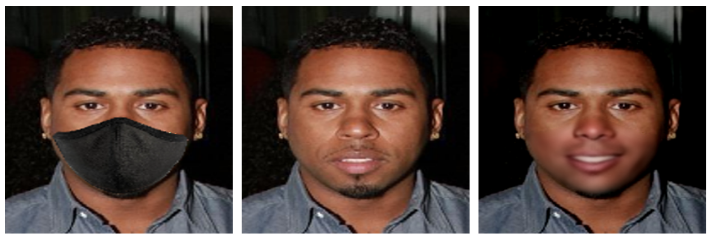

# Mask2face

Can you virtually remove a face mask to see what a person looks like underneath? Our Machine Learning team proves it’s possible via an image inpainting-based ML solution.

**Examples of results** (input | expected output | actual output)

## How to run this project

Results can be replicated by following those steps:

### How to setup ENV

- If your **system does not have an Nvidia CUDA device available**, please comment `tensorflow-gpu==2.2.0` in the _environment.yml_ file.
- If you are running MacOS, change `tensorflow==2.2.0` to `tensorflow==2.0.0` in the _environment.yml_ file.
- Use [Conda ENV Manager](https://towardsdatascience.com/a-guide-to-conda-environments-bc6180fc533) to create new ENV: `conda env create -f environment.yml`
- Activate the ENV: `conda activate mask2face`

### Get Data

- Download [Labeled Faces in the Wild data](http://vis-www.cs.umass.edu/lfw/lfw-deepfunneled.tgz) and unzip its content into _data_ folder or use `mask2face.ipynb` that will download it automatically.
- You can get better results using larger dataset or dataset with higher quality images. For example [CelebA dataset](http://mmlab.ie.cuhk.edu.hk/projects/CelebA.html) contains over 200 000 high quality images.

### Configuration

You can configure the project using the `configuration.json`. Some of the items are set up and should not be changed. However, changing some of the following items can be useful.

- `input_images_path`: Path to dataset with images that are input for the DataGenerator. If you want to use a different dataset than the default one, set the path to it here.
- `train_data_path`: Path where are training images generated and where training algorithm is looking for training data.
- `test_data_path`: Path where are testing images generated.
- `train_image_count`: Number of training image pairs generated by DataGenerator.
- `test_image_count`: Number of testing image pairs generated by DataGenerator.
- `train_data_limit`: Number of training image pairs used for model training.
- `test_data_limit`: Number of testing image pairs used for model testing.

### Train the model

- Run Jupyter server in the ENV: `jupyter notebook`
- Follow instructions in the _mask2face_ notebook

### Known Issues

- There might be a memory leak when training the model
